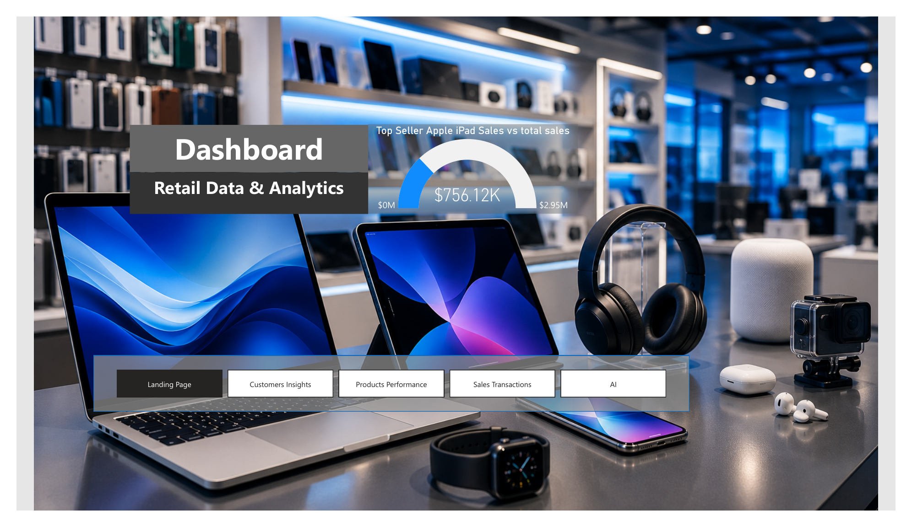
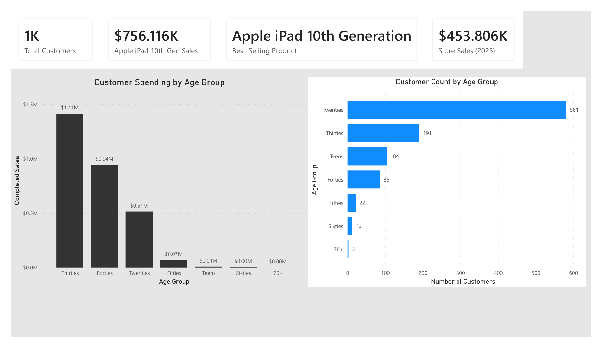
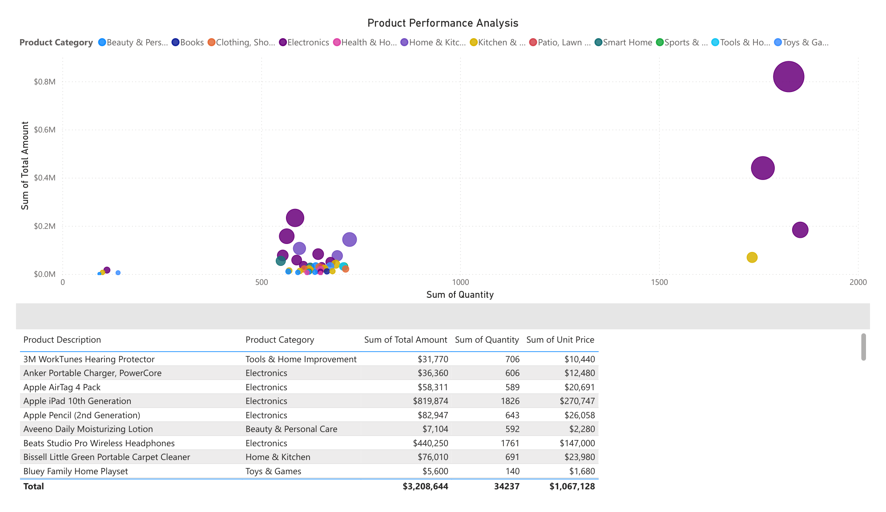
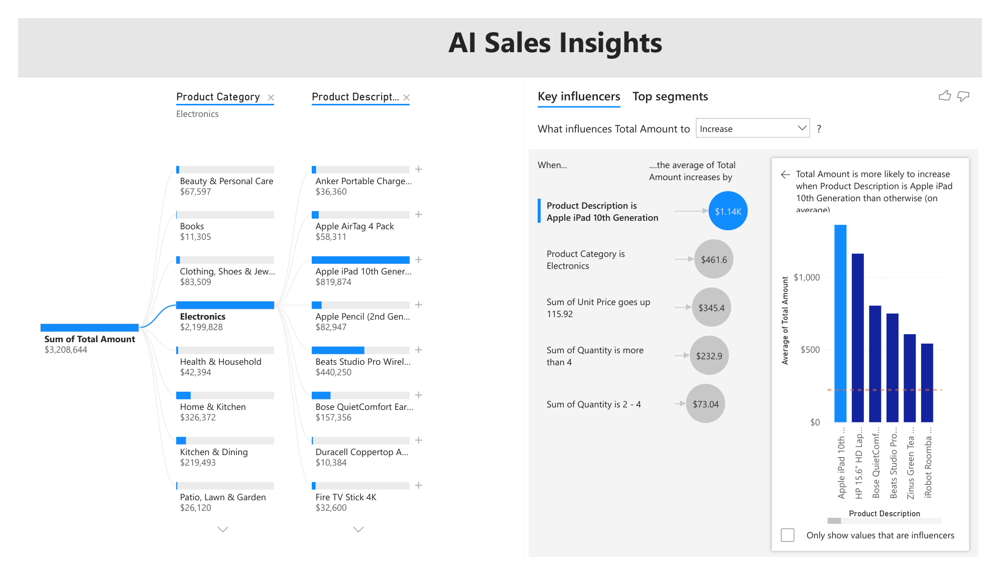

# 📊 Power BI Retail Sales Dashboard

> **Interactive Business Intelligence solution built in Power BI to analyze retail sales, customer behavior, and product performance, with AI-driven insights to support decision-making.**


---

## 🖼️ Dashboard Preview

<!-- FILL IN: Export each report page as PNG from Power BI Desktop (File > Export > or screenshot),
     save them in an /images folder in this repo, and update the paths below. -->






📄 Full report (all pages): [retail-sales-dashboard.pdf](retail-sales-dashboard.pdf)
📁 Power BI file: [retail-sales-dashboard.pbix](retail-sales-dashboard.pbix)

---

## 📋 Executive Summary

Retail organizations generate thousands of transactions that are difficult to interpret without effective reporting. This project transforms raw retail sales data into an interactive Power BI dashboard that lets decision-makers monitor KPIs, analyze customer purchasing behavior, evaluate product performance, and surface insights using Power BI's AI visuals.

The report combines a relational data model, DAX measures, interactive visuals, drill-through reporting, and AI visuals (Key Influencers, Decomposition Tree) to support informed business decisions.

*Originally built as a capstone during the Udacity Data Analyst Nanodegree; extended here into a portfolio project.*

---

## 🏢 Business Problem

Retail managers need fast, reliable answers to questions such as:

- Which products generate the most revenue?
- Which customer segments spend the most?
- Which product categories perform best?
- Which transactions require further investigation?
- What factors drive higher sales amounts?

Without centralized reporting, answering these means manually combing through spreadsheets. This dashboard replaces that with a single interactive view.

---

## 👥 Intended Users

Executive leadership · Sales managers · Operations managers · Marketing teams · Business analysts

---

## 🧱 Data Model

A star schema built for efficient filtering and accurate aggregation:

| Table | Type | Role |
| ----- | ---- | ---- |
| FactOrders | Fact | Transaction-level sales |
| DimCustomer | Dimension | Customer attributes / age groups |
| DimProduct | Dimension | Product & category attributes |
| StgInventory | Staging | Inventory support table |

---

## 📈 Key Performance Indicators

Total Sales · Total Customers · Completed Sales · Product Revenue · Quantity Sold · Sales by Category · Customer Age-Group Performance.

---

## 💡 Key Business Insights

- **Total catalog sales reached $3.21M across 34,237 units sold.**
- **The Apple iPad 10th Generation was the single top-selling product**, generating **$819,874** in revenue (1,826 units) — roughly **26% of total sales** from one SKU. Beats Studio Pro Wireless Headphones followed at **$440,250**.
- **Electronics dominated revenue**, driven by the iPad, Beats headphones, Apple Pencil, and AirTags — a small set of high-value products carries the catalog.
- **Volume ≠ value across age groups:** the **Twenties** had the most customers (581), but the **Thirties spent the most at $1.41M**, ahead of the Forties ($0.94M) — the highest-count segment is not the highest-spending one.
- Power BI's **Key Influencers** visual identified **product selection (Apple iPad), the Electronics category, higher unit price, and quantity purchased (>4)** as the strongest drivers of higher sales values — buying an iPad alone raised average order value by ~$1,140.
- **Transaction-level drill-through** lets users investigate any individual order and filter by category or order status in a couple of clicks.

---

## 💼 Business Recommendations

- Increase inventory for consistently high-performing products.
- Focus marketing spend on the highest-value customer segments.
- Monitor lower-performing categories for promotional opportunities.
- Use transaction-level reports to investigate unusual sales activity.
- Continue leveraging AI visuals to surface new revenue opportunities.

---

## 🛠 Skills Demonstrated

**Business Intelligence:** Dashboard design · KPI development · executive reporting · data storytelling
**Power BI:** Interactive dashboards · drill-through · bookmarks · navigation · slicers · AI visuals
**Data Modeling:** Star schema · fact/dimension tables · table relationships
**DAX:** Measures · calculated columns · aggregations · business metrics

---

## 📂 Repository Structure

```
powerbi-retail-sales-dashboard/
│
├── images/                      # Dashboard page screenshots
├── retail-sales-dashboard.pbix  # Power BI Desktop report
├── retail-sales-dashboard.pdf   # Static preview of all pages
└── README.md
```

---

## 🎓 Technologies Used

Power BI Desktop · DAX · Power Query · Data Modeling · Business Intelligence · Data Visualization

---

## 👤 Author

**Michael Jon-Baptiste** — Data Analyst
SQL · Python · Power BI · Tableau · Excel · Git

🔗 GitHub: https://github.com/Rozaay12 · 💼 [LinkedIn](https://www.linkedin.com/in/michael-jon-baptiste-b63001170)

⭐ *Feedback and suggestions are always welcome.*
